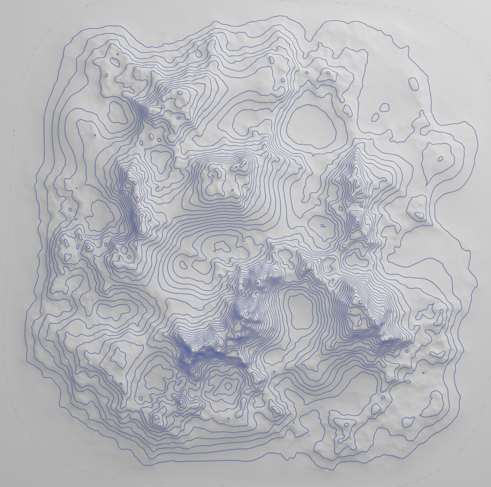

#Blender Contour Lines Generator

This repository contains a Blender project that uses Geometry Nodes to transform a 3D mesh into contour lines. 
It is specifically designed for landscape rendering, making it easy to add topographic details to terrain models.

Here is an example of the contour line effect applied to a landscape mesh:

